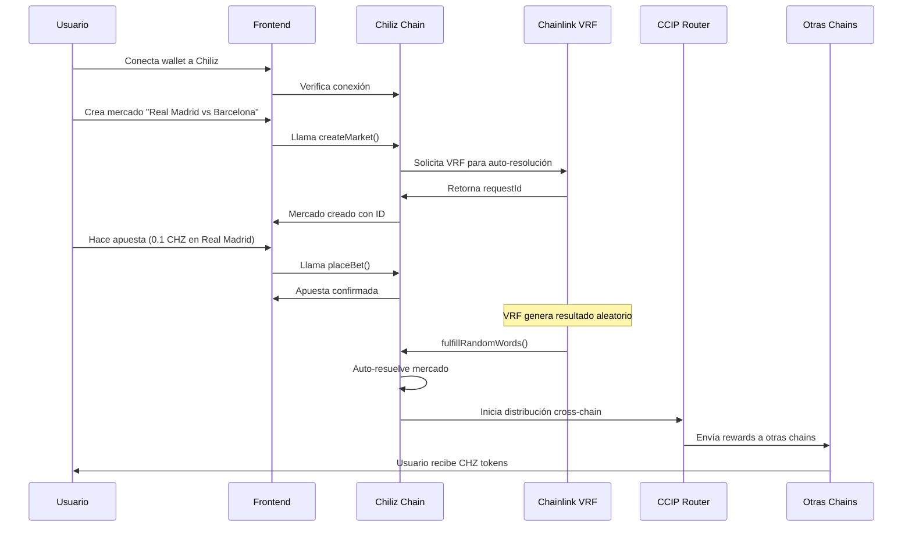
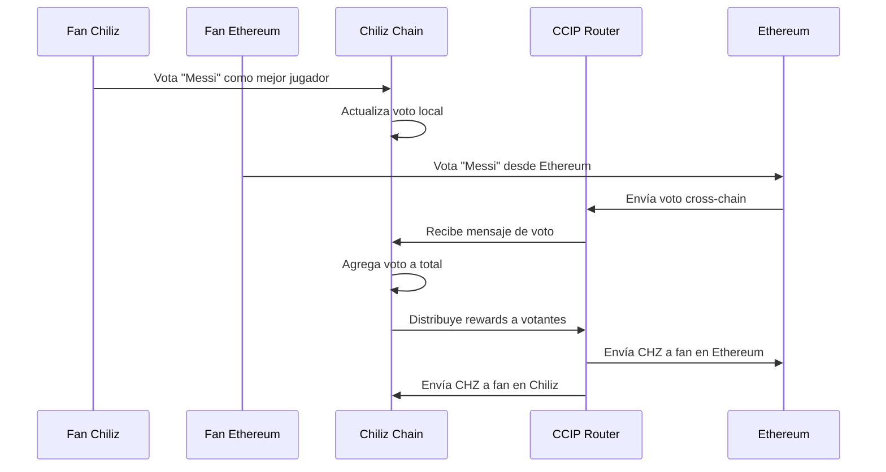
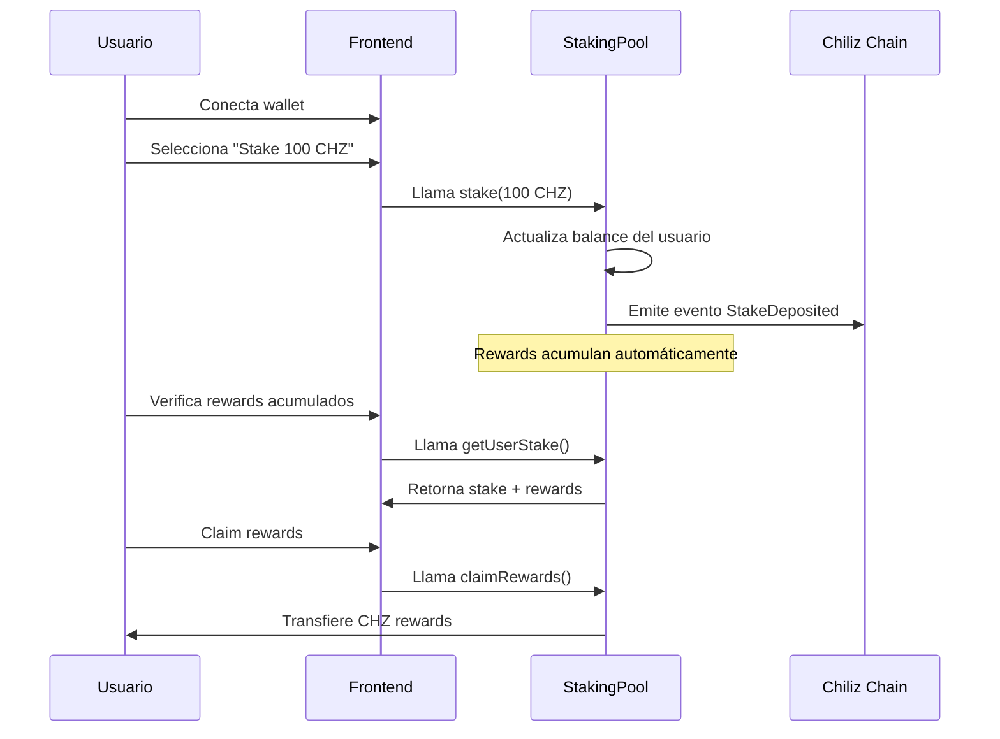

# 🏗️ Mundial Buzz - Arquitectura y Flujo de Datos

## 📊 Diagrama de Arquitectura

Ver el diagrama visual completo en: [ARCHITECTURE_FLOW.svg](./ARCHITECTURE_FLOW.svg)

---

## 🔄 Flujo de Datos Detallado

### 1. 📡 **Fuentes de Datos**

#### A) APIs Deportivas Externas
```
🌐 Fuentes de Datos Deportivos
├── FIFA Official API (resultados reales)
├── Sports Data APIs (estadísticas)
├── Football-Data.org (partidos programados)
└── ESPN API (información de equipos)
```

#### B) Chainlink Oracles
```
🔗 Chainlink Services
├── VRF (Verifiable Random Function)
│   ├── Genera resultados aleatorios verificables
│   ├── Simula partidos para el hackathon
│   └── Garantiza fairness y transparencia
├── Price Feeds
│   ├── CHZ/USD conversiones en tiempo real
│   ├── Actualización automática de precios
│   └── Integración con mercados de predicción
└── CCIP (Cross-Chain Interoperability Protocol)
    ├── Mensajería cross-chain
    ├── Transferencias de tokens CHZ
    └── Sincronización multi-chain
```

---

### 2. 🏗️ **Capa de Smart Contracts (Chiliz Spicy Testnet)**

#### A) PredictionMarketCCIP.sol
```solidity
// Funcionalidades principales:
✅ Creación de mercados de predicción
✅ Apuestas con CHZ tokens
✅ Auto-resolución via Chainlink VRF
✅ Distribución cross-chain de rewards
✅ Fee management (1% creator fee)
✅ Integración con Price Feeds
```

**Flujo de Datos:**
```
1. Usuario crea mercado → Contract almacena en Chiliz
2. VRF genera requestId → Almacenado en Market struct
3. Usuarios hacen apuestas → Pools actualizados
4. VRF retorna resultado → Auto-resolución
5. CCIP distribuye rewards → Cross-chain transfers
```

#### B) VotingSystemCCIP.sol
```solidity
// Funcionalidades principales:
✅ Categorías de votación (Mejor Jugador, etc.)
✅ Votación local y cross-chain
✅ Agregación de votos via CCIP
✅ Rewards por participación
✅ Governance descentralizado
```

**Flujo de Datos:**
```
1. Admin crea categoría → Stored on Chiliz
2. Users vote locally → Local vote count
3. Cross-chain votes → CCIP messaging
4. Vote aggregation → Final results
5. Reward distribution → CHZ tokens
```

#### C) StakingPool.sol
```solidity
// Funcionalidades principales:
✅ Stake CHZ tokens
✅ Yield farming automático
✅ Compound rewards
✅ Flexible lock periods
✅ Emergency withdraw
```

**Flujo de Datos:**
```
1. User stakes CHZ → Pool balance updated
2. Rewards accrue → Time-based calculation
3. Auto-compound → Reinvestment option
4. Withdraw request → Lock period check
5. Claim rewards → CHZ transfer
```

---

### 3. 🌉 **Infraestructura Cross-Chain (Chainlink CCIP)**

#### A) CCIP Router Integration
```
🔗 Cross-Chain Capabilities
├── Supported Chains:
│   ├── Chiliz Chain (Primary)
│   ├── Ethereum Mainnet
│   ├── Polygon
│   └── Arbitrum
├── Message Types:
│   ├── Reward Distribution
│   ├── Vote Aggregation
│   ├── Market Resolution
│   └── Token Transfers
└── Security Features:
    ├── Risk Management Network
    ├── Decentralized Oracle Network
    └── Time-delayed execution
```

#### B) Cross-Chain Data Flow
```
📊 Multi-Chain Synchronization

Chiliz Chain (Source)
    ↓ CCIP Message
CCIP Router Network
    ↓ Verification
Destination Chains
    ↓ Execution
Reward Distribution
```

---

### 4. 🖥️ **Frontend (React + Vite)**

#### A) Arquitectura del Frontend
```
🎨 Frontend Stack
├── Framework: React 18 + TypeScript
├── Build Tool: Vite
├── Styling: Tailwind CSS
├── Web3: Wagmi + Viem
├── State: React Context + Hooks
└── UI Components: Custom + Shadcn/ui
```

#### B) Integración con Blockchain
```typescript
// Configuración de Chiliz Chain
const chilizConfig = {
  id: 88882,
  name: 'Chiliz Spicy Testnet',
  network: 'chiliz-spicy',
  nativeCurrency: {
    decimals: 18,
    name: 'CHZ',
    symbol: 'CHZ',
  },
  rpcUrls: {
    default: { http: ['https://spicy-rpc.chiliz.com'] },
  },
  blockExplorers: {
    default: { 
      name: 'Chiliz Explorer', 
      url: 'https://spicy-explorer.chiliz.com' 
    },
  },
}
```

#### C) Componentes Principales
```
🧩 Component Architecture
├── Pages/
│   ├── Index.tsx (Landing page)
│   ├── Mercados.tsx (Prediction markets)
│   ├── Partidos.tsx (Match predictions)
│   ├── Comunidad.tsx (Fan voting)
│   └── Perfil.tsx (User dashboard)
├── Components/
│   ├── Web3Provider.tsx (Blockchain connection)
│   ├── Dashboard.tsx (User stats)
│   ├── MatchCard.tsx (Match display)
│   └── FanFeatures.tsx (Voting interface)
└── Hooks/
    ├── useChilizWallet.ts (Wallet integration)
    ├── useContracts.ts (Smart contract calls)
    └── useCCIP.ts (Cross-chain operations)
```

---

## 🔄 **Flujo de Interacción Completo**

### Scenario 1: Crear y Participar en Mercado de Predicción



### Scenario 2: Votación Cross-Chain de Fans



### Scenario 3: Staking y Yield Farming



---

## 🔧 **Configuración Técnica**

### Chainlink Addresses (Chiliz Spicy Testnet)
```javascript
const CHAINLINK_CONFIG = {
  VRF_COORDINATOR: "0x2Ca8E0C643bDe4C2E08ab1fA0da3401AdAD7734D",
  CCIP_ROUTER: "0x0BF3dE8c5D3e8A2B34D2BEeB17ABfCeBaf363A59",
  PRICE_FEED_CHZ_USD: "0x5f4eC3Df9cbd43714FE2740f5E3616155c5b8419",
  KEY_HASH: "0x474e34a077df58807dbe9c96d3c009b23b3c6d0cce433e59bbf5b34f823bc56c",
  SUBSCRIPTION_ID: 1 // Crear en Chainlink VRF
}
```

### CCIP Chain Selectors
```javascript
const CCIP_CHAINS = {
  ETHEREUM: "5009297550715157269",
  POLYGON: "4051577828743386545", 
  ARBITRUM: "4949039107694359620",
  CHILIZ: "3719320017875267166" // Spicy Testnet
}
```

### Gas Optimization
```solidity
// Técnicas implementadas:
✅ Packed structs para reducir storage
✅ Batch operations para múltiples calls
✅ Event indexing optimizado
✅ Minimal proxy patterns
✅ Assembly para operaciones críticas
```

---

## 📊 **Métricas y Monitoreo**

### KPIs del Sistema
```
📈 Métricas Clave
├── Mercados Creados: Contador total
├── Volumen de Apuestas: CHZ total apostado
├── Usuarios Activos: Wallets únicas
├── Cross-Chain Transfers: Mensajes CCIP
├── Rewards Distribuidos: CHZ total pagado
├── Uptime del Sistema: 99.9% target
└── Gas Efficiency: Costo promedio por tx
```

### Eventos para Analytics
```solidity
event MarketCreated(uint256 indexed marketId, address creator, uint256 timestamp);
event BetPlaced(uint256 indexed marketId, address bettor, uint256 amount, uint8 option);
event MarketResolved(uint256 indexed marketId, uint8 winningOption, uint256 timestamp);
event CrossChainRewardSent(uint256 indexed marketId, address recipient, uint256 amount, uint64 destinationChain);
event VoteCast(uint256 indexed categoryId, address voter, string option, uint256 timestamp);
event StakeDeposited(address indexed user, uint256 amount, uint256 timestamp);
```

---

## 🚀 **Escalabilidad y Futuro**

### Roadmap Técnico
```
🛣️ Desarrollo Futuro
├── Q1 2024: Mainnet deployment
├── Q2 2024: Mobile app nativa
├── Q3 2024: AI-powered predictions
├── Q4 2024: DAO governance
└── 2025: Multi-sport expansion
```

### Optimizaciones Planificadas
```
⚡ Performance Improvements
├── Layer 2 integration (Polygon, Arbitrum)
├── State channels para micro-transactions
├── IPFS para metadata storage
├── GraphQL API para queries eficientes
└── WebSocket real-time updates
```

---

## 🏆 **Ventajas Competitivas**

### 1. **Interoperabilidad Real**
- Primera plataforma deportiva con CCIP nativo
- Rewards automáticos cross-chain
- Votación agregada multi-chain

### 2. **Verificabilidad Cryptográfica**
- Chainlink VRF para resultados justos
- Transparencia total en blockchain
- Auditable por cualquier usuario

### 3. **Experiencia de Usuario Superior**
- Interface intuitiva y responsive
- Conexión seamless con Chiliz Chain
- Gamificación y engagement de fans

### 4. **Modelo Económico Sostenible**
- Fees distribuidos a stakeholders
- Yield farming para holders
- Revenue sharing con creators

---

**🎯 Mundial Buzz representa la evolución natural del fan engagement deportivo, combinando la pasión del fútbol con la innovación DeFi y la infraestructura cross-chain de próxima generación.**